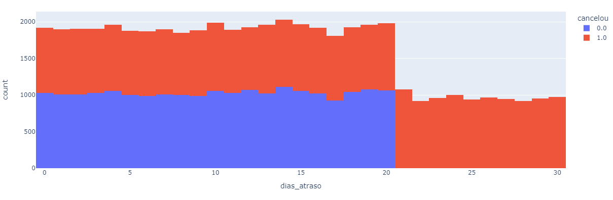
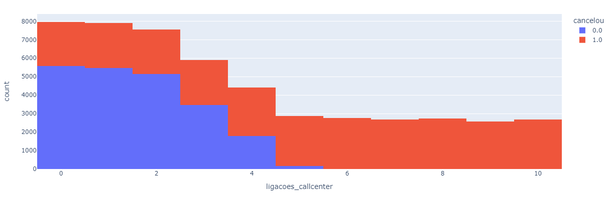
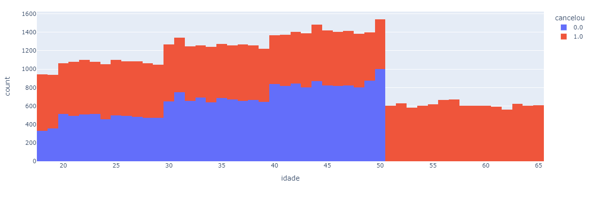
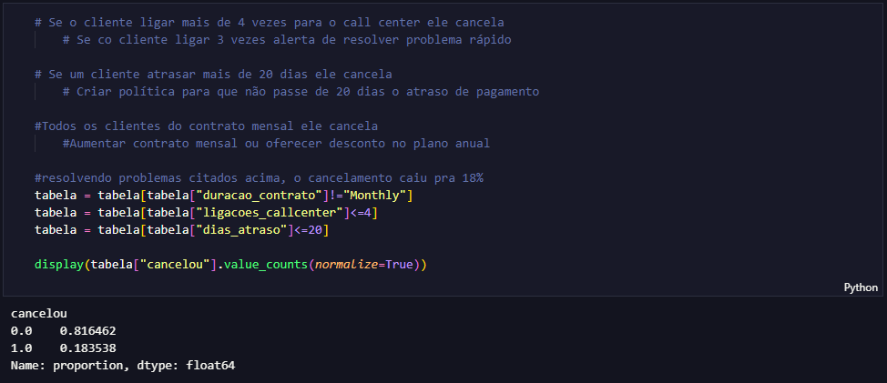

# Descrição

Um projeto fictício foi elaborado com o objetivo de addressar um desafio relacionado ao cancelamento de serviços em uma empresa. Neste projeto, uma análise foi conduzida com base nos dados fornecidos pela organização, culminando na proposição de uma solução apropriada para o problema identificado


## Instalação
O projeto foi desenvolvido em python através do Visual Stdudio Code

Use o gerenciador de pacotes [pip](https://pip.pypa.io/en/stable/) para instalar o pandas e o plotly.

```bash
pip install pandas plotly
```
    
## pandas e plotly

São bibliotecas do python usadas para manipulação de dados e criação de gráficos

## Gráficos
Graficos elaborados no python com plotly








## Solução do problema


